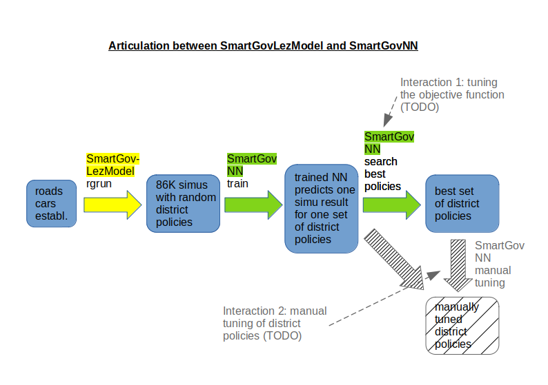

# Launch
The .jar can be run using the following command (make sure you have a JRE 8+ installed on your system) :
`java -jar SmartGovLez-MASTER.jar`

An important option to use is the maximum memory allocated to the JVM. If your model has relatively heavy inputs (especially because of OSM data), you might need to increase this memory size, otherwise the JVM will crash with memory errors. To do so, add the `-Xmx<size>` option to the Java command, depending on your system resources. For example, to allow 6GB RAM usage :

`java -Xmx6g -jar SmartGovLez-MASTER.jar`

From now, the command above will be mentionned simply as smartgovlez.
So running `smartgovlez`, `smartgovlez -h` or `smartgovlez --help` will display a help message about available tasks.

# Tasks

## Roads

```
usage: smartgovlez roads -f <file> [-h] -n <file> -w <file>

 Build JSON nodes and ways input file from the specified osm node.
 -f,--osm-file <file>     Input OSM file
 -h,--help                Displays help message
 -n,--nodes-file <file>   JSON nodes output file
 -w,--ways-file <file>    JSON ways output file

 Process :
- Loads the input .osm file.
- Filters ways to keep required highways.
- Filters tags to keep 'highway', 'name', 'ref', 'oneway' and 'service'
tags.
- Writes the output nodes and ways files to [nodes-file] and [ways-file]
 ```
 
 The first required task is the road task. It allows you to build the nodes and ways file from a preprocessed .osm file (see the [SmartGovSimulator](https://github.com/smartgov-liris/SmartGovSimulator/wiki/Osm-Data#preprocess-data) documentation for details).
 
 More precisely, the following highways are kept :

`motorway`, `trunk`, `primary`, `secondary`, `tertiary`, `unclassified`, `residential`, `motorway_link`, `trunk_link`, `primary_link`, `secondary_link`, `tertiary_link`, `living_street`

In addition, `service` ways are also kept, but only if they have a defined `service` tag that corresponds to `alley`, `parking-aisle` or `driveway`.

See the [OSM documentation](https://wiki.openstreetmap.org/wiki/Highways) for more details about highways.

The generated files might then be used as an input for the following processes.


## Politic Run

```
usage : smartgovlez prun [-c <file>] [-h] [-t <int>] [-i <int>] [-a <int>]
 -c,--config-file <file>    Input configuration file
 -h,--help                  Displays help message
 -t,--max-ticks <int>       Max ticks (1 tick = 1 second)
 -i,--max-iterations <int>  Number of iterations (1 iteration = 1 simulation)
 -a,--nb-agents <int>       Number of agents in simulation


```

The `politic run` task will launch simulations and reinforcement learning module in order to learn optimal policy thanks to simulation results. Environments created will be saved in json files, in the `output_political` folder. These files can be visualised by a [lez-viewer](https://github.com/smartgov-liris/lez-viewer-Thomas).
As the simulation is mainly mono-core, it takes a long time to learn optimal policies.
This is the main task of the project. Its only prerequisite is the [Roads task](#Roads) task.

## Result Generator Run

```
usage : smartgovlez rgrun [-c <file>] [-h] [-t <int>] [-i <int>] [-a <int>]
 -c,--config-file <file>    Input configuration file
 -h,--help                  Displays help message
 -t,--max-ticks <int>       Max ticks (1 tick = 1 second)
 -i,--max-iterations <int>  Number of iterations (1 iteration = 1 simulation)
 -a,--nb-agents <int>       Number of agents in simulation
```

Default value for the number of iterations is 1000.
The `Result Generator Run` task will launch many simulations with random configuration in order to save their result. They are saved in the file `output/config.txt`. This file can then be used by [SmartGovNN](https://github.com/smartgov-liris/SmartGovNN) to train a neural network in order to predict results of simulations.




# Inputs

Inputs file paths for Init, Run, PoliticRun and ResultGenerator are in the configuration file (default is `input/static_config_lez.properties`). 

Exemple :
```
# Scenario
scenario=LezDeliveries

# Input Files
nodes=osm/simturb_nodes.json
roads=osm/simturb_ways.json
establishments=establishment/establishments_simturb_extended100.json
fleet_profiles=establishment/fleetProfiles.json

## copert
copert_table=copert/Hot_Emissions_Parameters_France_reversed_column.csv

# Output Files
outputDir=../output/lez/

#dimensions
dimensions=osm/size.json

#political layer
politicalLayer = political/variables.txt
```

The name of the scenario of the simulation. For now, the only scenario in this project is `LezSimulation`.
`nodes` and `roads` files are generated by the [Roads task](#Roads).

## Establishments

Establishments are described using the following format :

```
[
    {
        "ST8": "1",
        "id": "52126036400018",
        "name": "establishment_name",
        "rounds": [
            {
                "departure": "10.75",
                "ids": [
                    "50849661900034",
                    "51049541900028",
                    "39478915000023",
					...
                ]
            }
        ],
        "lat": "45.123456",
        "lon": "4.84576208"
    },
	...
]
```

- `ST8` : The establishment ST8 category. Can be specified using the enum names, or the corresponding code (see the [associated javadoc](../docs/org/liris/smartgov/lez/core/agent/establishment/ST8.html))
- `id` : An arbitrary id. For France, the SIRET is a good choice.
- `name` : Establishment name
- `rounds` : A list of rounds the establishment should perform.
  - `departure` : departure hour, in hour, base 24. e.g. : `10.75` => `10:45am`, `17.5` => `5:30pm`. Used only to create delivery agents.
  - `ids` : an ordered list of establishments ids to deserve. The origin establishment will be automatically added at the beginning and at the end of the round, so should not be added there.
- `lat` : establishment latitude
- `lon` : establishment longitude

`lat` and `lon` will actually be used to compute the shortest OSM node available in the preprocessed OSM graph, so coordinates does not need to exactly correspond to anything.

## Fleet profiles

This file is used to define the proportions of different types of vehicles. The different parameters are the ones that are used by the [COPERT model](https://www.emisia.com/utilities/copert/). Here is the syntax of this file :

```
{
	"header": "Root_COPERT_Header",
	"values": 
	[
			{
				"value": "Parent_Header_Value",
				"rate": 0.5,
				"subProfile": {
					"header": "Child_Header",
					"values":
					[ {
						"value": "Parent_Header_Value_1",
						"rate": 0.2 
					},
					{
						"value": "Parent_Header_Value_2",
						"rate": 0.4 
					},
					...
					]
				}
			},
			...
	]
}
```


- `header` : A COPERT Header, from which we will defined sub-categories. Possible values :
  - `CATEGORY`
  - `FUEL`
  - `SEGMENT`
  - `EURO_STANDARD`
  - `TECHNOLOGY`
- `values` : The set of values used for this `header`. Each value can itself define sub-categories
  - `value` : value associated to the header. See the COPERT data and the javadoc to check which values are available for each header.
  - `rate` : proportion of the given value. The sum of all rates at a given level must equal to 1.0, otherwise errors will be thrown.
  - `subProfile` : optional. If defined, the root structure presented there is used recursively. Following `headers` / `values` must be understood as "Child value for the given child header with the given rate, provided that the parent value for the parent header is value"

## Copert Table

A file created by COPERT software. If you want to download your own file instead of using the file we provide in this project. you just have to know that we inversed `segment` column and `euro standard` column. Datas are then in this order :
- `Category`
- `Fuel`
- `Euro standard`
- `Segment`
- `Technology`

This table is used to define vehicles, thanks to the [Fleet profiles](#fleet-profiles) file.

## Dimensions

The dimensions file is used to create the political configurations, and the neighborhood we want. Currently, we only use the bounds of the map, and we create a grid, where each square is a neighborhood.
Here is the syntax :

```
{
    "nb_squares" : 4,
    "dimensions" :
    {
        "north_bound" : 46.146,
        "south_bound" : 45.43,
        "west_bound" : 4.4,
        "east_bound" : 5.46
    },
    "deliveryRestriction" : "NONE",
    "privateRestriction" : "NONE",
    "surveillance" : "NO_SURVEILLANCE"
}
```

- `nb_squares` is the number of squares on a line (or a column). Precisely, `nb_squares = 4` will create a `4*4` grid, then 16 neighborhoods will be created.
- `dimensions` gives the bounds of the space we consider in our simulation
- `deliveryRestriction` gives the restriction for delivery vehicles for the first simulation. It uses [Crit'air](https://www.certificat-air.gouv.fr/) to define this restriction. Values can be `CRITAIR_1`, `CRITAIR_2`, `CRITAIR_3`, `CRITAIR_4`, `CRITAIR_5` or `NONE`. The value can change for every neighborhood during learning of relevant policies while using [prun task](#politic-run).
- `privateRestriction`gives the restriction for private vehicles. It uses the same values, and can also change while learning relevant policies.
- `surveillance`gives the surveillance in the neighborhoods. Values can be `NO_SURVEILLANCE`, `PATROL`, `CAMERA`, `BARRIER`, `CHEAP_TOLL`, `EXPENSIVE_TOLL`. Values can change during learning of relevant policies.

## Political Layer

This file is used for the configuration of the political layer, used by [prun task](#politic-run).
Here are the most important parameters of this file :

- `simulations_per_action` is the number of simulation we launch for one policy, applying new political choices.
- `simulation_before_restart` is the number of simulation we launch before restarting to the state defined by [dimensions files](#Dimensions), the original state.
- `nb_epoch` is the number of epochs, the number of time we restart the simulation to the original state. For instance, if we have the values `simulations_per_action:1`, `simulation_before_restart:15`, `nb_epoch:40`, 600 simulations will be launched.
